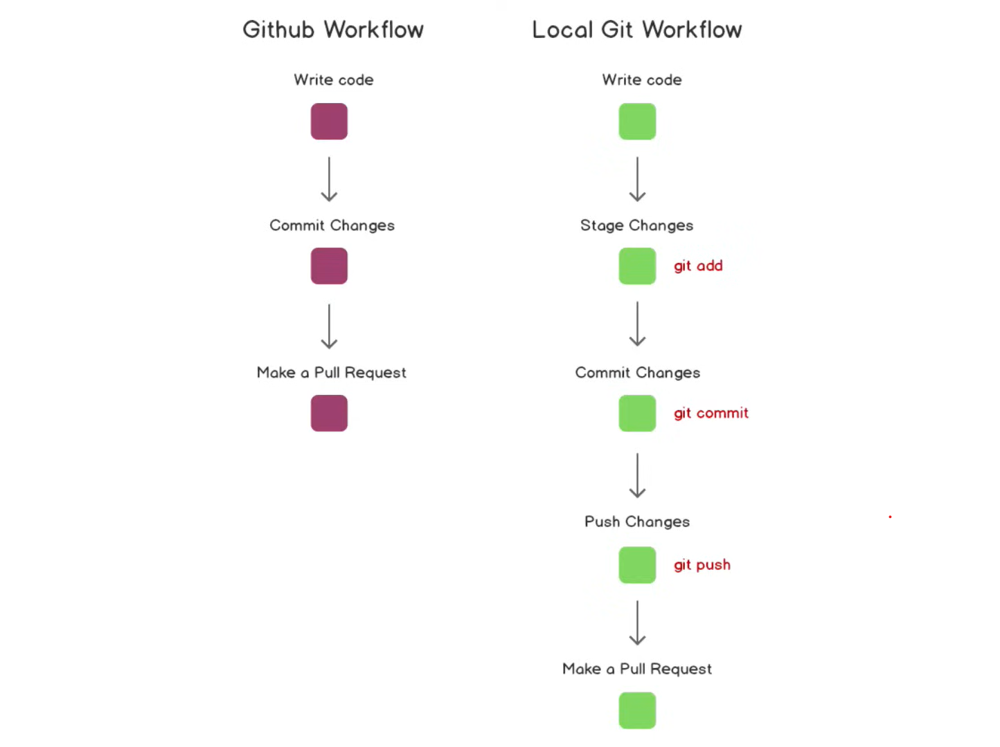

## Referal
- [How to use the git remote add origin command](https://www.theserverside.com/video/How-to-use-the-git-remote-add-origin-command-to-push-remotely)

- ["$git push origin main" instead of "$git push origin master" #4356](https://github.com/git-lfs/git-lfs/issues/4356)

- [GitHub "fatal: remote origin already exists"](https://stackoverflow.com/questions/10904339/github-fatal-remote-origin-already-exists)

---
### Git Branch Strategy
- [Branching Strategies Guide: Code Branching Strategy Best Practices](https://www.perforce.com/blog/vcs/best-branching-strategies-high-velocity-development)

- [Code Branching Definition — What Is a Branch?](https://www.perforce.com/blog/vcs/branching-definition-what-branch#top)

- [Version Control Branching Strategies](https://medium.com/@dmosyan/version-control-branching-strategies-e68e8d5ef1e0)

- [Branching strategy: a path to greatness](https://www.atlassian.com/agile/software-development/branching)

- [What Is Continuous Integration - CI? ](https://www.perforce.com/blog/kw/what-is-continuous-integration)

